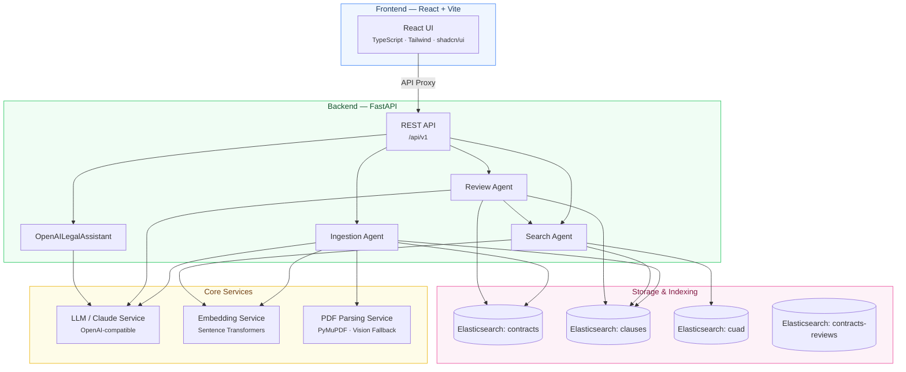
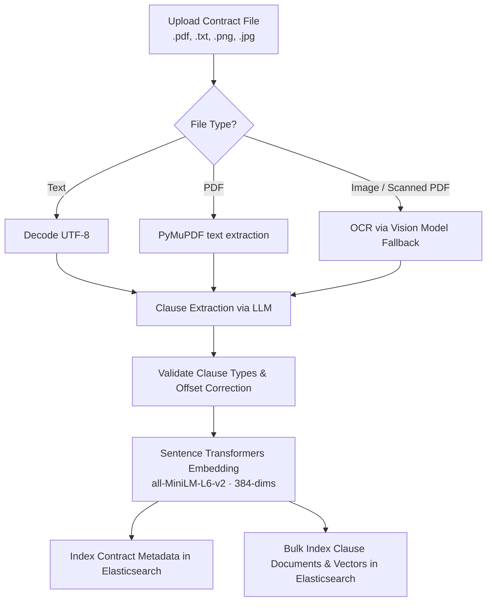
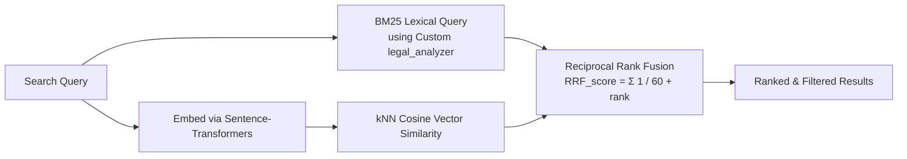

# ClauseGuard

**ClauseGuard** is an enterprise-grade, multi-agent legal contract review system. It ingests contracts (PDFs, text files, and images), extracts clauses via AI, supports hybrid lexical/semantic search, and performs compliance reviews using either a parallel multi-agent audit or a template-based comparison grounded by expert legal precedents.

The application is structured with a FastAPI backend, an Elasticsearch storage layer, a Sentence-Transformers local embedding model, and an interactive React web dashboard.

---

## Architecture



---

## Detailed Data Flow (Ingestion to Output)

### 1. Data Ingestion Pipeline
When a contract is uploaded via the UI or seed scripts, the system processes it through a strict multi-stage ingestion pipeline implemented in `IngestionAgent` ([ingestion.py](file:///c:/Users/rohan/Documents/ClauseGuard-main/clauseguard/agents/ingestion.py)):



* **Parsing**: Handles text and PDF uploads via PyMuPDF (`fitz`). If a PDF page is scanned and lacks text, it falls back to rendering page images as PNG/JPEG base64 payloads to process via the configured vision model (e.g. `gpt-4o`).
* **LLM Clause Extraction**: Sends parsed text to `ClaudeService` to identify distinct legal clauses verbatim and categorize them into a standard `ClauseType` (e.g., `indemnity`, `liability_cap`, `termination`, `confidentiality`, `governing_law`, `data_protection`, `ip_assignment`, `force_majeure`, or `other`).
* **Offset Correction**: Verifies the exact starting and ending characters of each clause in the source text using fuzzy substring matching against the LLM's approximate offset coordinates.
* **Vector Embeddings**: Encodes clause texts into 384-dimensional dense vectors using a local Sentence-Transformers model (`all-MiniLM-L6-v2`).
* **Elasticsearch Storage**: 
  * Indexes contract metadata (e.g. title, page counts, timestamp, clauses found) in `clauseguard-contracts`.
  * Indexes individual clauses, parent references, offsets, and their dense vector embeddings in `clauseguard-clauses`.

---

### 2. Hybrid Lexical & Semantic Search
ClauseGuard uses a hybrid search agent ([search.py](file:///c:/Users/rohan/Documents/ClauseGuard-main/clauseguard/agents/search.py)) to fetch clauses from indexed contracts or expert CUAD annotations:



* **Custom Analysis**: Uses `legal_analyzer` (standard tokenizer + lowercase + stopword + snowball stemming filters) for precise matches of legal terms.
* **Reciprocal Rank Fusion (RRF)**: Merges the scores of BM25 (exact keyword match) and kNN (semantic cosine similarity) queries. It calculates:
  $$\text{RRF\_score} = \sum_{m \in M} \frac{1}{60 + \text{rank}_m}$$
  This ensures results appearing high in both keyword and vector searches are prioritized.
* **CUAD Database**: A separate command-line tool parses the CUADv1 dataset (`CUADv1.json`) and populates a specialized `clauseguard-cuad` index with thousands of expert-annotated legal precedents to ground contract comparisons.

---

### 3. Compliance Review & Multi-Agent Risk Audit
The compliance audit features two primary pipelines:

#### Pipeline A: Parallel 5-Agent Review (Active Web Endpoint)
Triggered by `review_contract` in [review.py](file:///c:/Users/rohan/Documents/ClauseGuard-main/clauseguard/api/review.py). It reconstructs the chronological contract flow and invokes `OpenAILegalAssistant` ([openai_assistant.py](file:///c:/Users/rohan/Documents/ClauseGuard-main/clauseguard/openai_assistant.py)) to spawn 5 specialized auditing subagents in parallel:
1. **Clause Analysis Agent**: Generates short names, category normalizations, impact summaries, and recommendations.
2. **Risk Assessment Agent**: Identifies legal, operational, and commercial risks, highlighting severity (High, Medium, Low, Info) and mitigations.
3. **Compliance Audit Agent**: Evaluates compliance obligations (e.g. DPA, GDPR/CCPA) and tags status (Pass, Fail, Partial, N/A).
4. **Negotiation Strategy Agent**: Formulates negotiation objectives, leveraging counterparty positions, and draft alternative text.
5. **Missing Protections Agent**: Pinpoints gaps, providing justifications and suggested draft clauses.

The assistant aggregates these audits, computes a **Safety Score** (deducting points for high/critical findings and missing protections), calls the LLM to write a concise **Executive Summary**, and saves the result in `contracts-reviews`.

#### Pipeline B: Template-based Review (Agent Workflow)
Executed by `ReviewAgent` ([review.py](file:///c:/Users/rohan/Documents/ClauseGuard-main/clauseguard/agents/review.py)), this pipeline matches the contract's clauses directly against company-approved baseline templates (`DEFAULT_TEMPLATES` in [defaults.py](file:///c:/Users/rohan/Documents/ClauseGuard-main/clauseguard/templates/defaults.py)). 
For each clause, it queries the `clauseguard-cuad` index to fetch matching expert legal precedents, passing them to the LLM to establish grounded comparisons and identify template deviations.

---

### 4. Output Generation & Exports
* **Interactive UI**: Users inspect the safety gauge, executive summary, risk breakdown cards, missing protection suggestions, and negotiation redlines directly on the React frontend.
* **PDF Report (CLI)**: Running the CLI command calls `generate_legal_pdf` ([generate_legal_pdf.py](file:///c:/Users/rohan/Documents/ClauseGuard-main/scripts/generate_legal_pdf.py)) using ReportLab to write a professional, table-based legal audit PDF to disk.
* **Excel Export (Web & API)**: Generates a multi-sheet spreadsheet using `openpyxl` with color-coded severity metrics, auto-fitted cells, and frozen headers.

---

## Tech Stack

| Component | Technology | Description |
|:------|:-----------|:------------|
| **Frontend** | React 18, TypeScript, Vite, Tailwind CSS, shadcn/ui, Lucide Icons | Responsive legal dashboard, file uploader, and interactive visual audits. |
| **Backend** | Python 3.10+, FastAPI, Pydantic v2, Pydantic-Settings, Uvicorn | Async web API, agent orchestration, and pipeline services. |
| **Search Engine**| Elasticsearch 8.16+ | Handles BM25 text indices, kNN cosine vector fields, and RRF rank fusion. |
| **Embeddings** | Sentence Transformers (`all-MiniLM-L6-v2`) | Local execution converting text chunks into 384-dimensional dense vectors. |
| **LLM Services** | OpenAI / Claude API (compatible endpoint) | Performs clause extraction, agent review loops, summaries, and generation. |
| **Parsing & PDF** | PyMuPDF (`fitz`), PyPDF2 | Extracts layout text, counts pages, and renders page images for vision OCR. |
| **Reports** | ReportLab, openpyxl | Programmatically compiles legal PDFs and styled Excel sheets. |

---

## Project Structure

```
ClauseGuard/
├── clauseguard/                    # Backend Source Code
│   ├── main.py                     # FastAPI application setup, lifespan events, and Uvicorn runner
│   ├── config.py                   # Pydantic BaseSettings loading configs from .env
│   ├── openai_assistant.py         # Async multi-agent workflow driver utilizing OpenAI Chat client
│   ├── agents/                     # Processing Agents
│   │   ├── ingestion.py            # Coordinate text extraction, clause parser, offsets, embeddings, and ES indexing
│   │   ├── search.py               # Orchestrates BM25 + kNN hybrid searches and CUAD retrieval queries
│   │   └── review.py               # Evaluates clauses against baseline templates grounded by CUAD examples
│   ├── services/                   # Utility Wrappers
│   │   ├── claude_service.py       # Handles OpenAI-compatible requests, prompt templates, and backoff retries
│   │   ├── elasticsearch_service.py# Manages ES mappings, indexing, and Reciprocal Rank Fusion queries
│   │   ├── embedding_service.py    # Implements Sentence Transformers for local vector generation
│   │   └── pdf_service.py          # Extracts text from PDFs and TXT files using PyMuPDF
│   ├── models/                 # Pydantic Schemas
│   │   ├── clause.py               # ExtractedClause and ClauseType structures
│   │   ├── contract.py             # ContractMetadata and responses
│   │   ├── cuad.py                 # CUAD search request and response structures
│   │   ├── openai_legal.py         # 5-Agent outputs, safety scores, and generation schemas
│   │   ├── report.py               # Template finding schemas and severities
│   │   ├── search.py               # Search parameters and hits
│   │   └── template.py             # ClauseTemplate parameters
│   └── templates/
│       └── defaults.py             # Default compliance templates (Indemnity, Liability, NDA, GDPR, etc.)
├── frontend/                       # React Frontend Application
│   ├── src/
│   │   ├── pages/                  # Dashboard, Upload, Detail, Search, Review views
│   │   ├── components/             # Reusable UI widgets (e.g. RiskGauge, FindingCard)
│   │   ├── lib/                    # HTTP client configuration and constants
│   │   └── types/                  # TypeScript API declarations
│   └── package.json
├── scripts/                        # Maintenance & CLI Utilities
│   ├── generate_legal_pdf.py       # Helper creating styled ReportLab PDFs
│   ├── load_cuad.py                # Command to seed and vector-index CUADv1 dataset
│   ├── test_review_export.py       # Test script generating sample Excel review sheets
│   └── run_openai_test.py          # Quick connection sanity check for the OpenAI API
├── sample_contracts/               # Standard legal files for seeding (NDAs, SaaS, Services)
├── seed.sh                         # Bash script to parse and upload sample contracts
├── docker-compose.yml              # Configures local Elasticsearch Docker container
├── pyproject.toml                  # Python package metadata and requirements
└── README.md                       # Comprehensive documentation (this file)
```

---

## Getting Started

### Prerequisites
* Python 3.10 or higher
* Node.js 18 or higher
* Docker installed and running

### 1. Launch Elasticsearch
Start the local Elasticsearch instance using Docker Compose:
```bash
docker compose up -d
```
Verify ES is running by navigating to `http://localhost:9200`.

### 2. Configure Environment Variables
Copy the sample environment file and enter your API credentials:
```bash
cp .env.example .env
```
Ensure your `.env` contains valid OpenAI endpoints and keys:
```env
OPENAI_API_KEY=sk-your-openai-api-key
OPENAI_BASE_URL=https://api.openai.com/v1
OPENAI_MODEL=gpt-4o-mini
OPENAI_VISION_MODEL=gpt-4o
```

### 3. Install & Start Backend
Install the package in editable mode and run the development server:
```bash
pip install -e .
clauseguard
```
The FastAPI backend starts at `http://localhost:8000`. On first start, it will automatically download the local embedding model (`~80MB`).

### 4. CLI Auditing & Generation
Use the `legal.py` CLI tool to run reviews and generation from the command line:
```bash
# Run a full compliance audit and generate a PDF report next to the contract
python legal.py review sample_contracts/sample_nda.txt

# Run risk analysis only
python legal.py risks sample_contracts/sample_nda.txt

# Generate a business NDA draft from a description
python legal.py nda "Mutual NDA for software services engagement"
```

### 5. Install & Start Frontend
In a separate terminal, navigate to the frontend directory, install packages, and start the development server:
```bash
cd frontend
npm install
npm run dev
```
Open `http://localhost:5173` in your browser. The Vite dev server will proxy API requests to port `8000`.

### 6. Seeding Sample Contracts (Optional)
To quickly populate the dashboard with 8 sample contracts (NDAs, SaaS agreements, consulting contracts, etc.):
```bash
bash seed.sh
```

### 7. Seeding the CUAD Database (Optional)
To index the expert-annotated CUAD database for template-based grounding:
1. Download the `CUADv1.json` dataset and place it in the project root.
2. Run the loader script:
   ```bash
   python scripts/load_cuad.py --path CUADv1.json
   ```

---

## Configuration Reference

The following environment variables configure the backend (defined in `clauseguard/config.py`):

| Variable | Default Value | Description |
|:---------|:--------------|:------------|
| `OPENAI_API_KEY` | `""` | API key for OpenAI (or custom model provider) |
| `OPENAI_BASE_URL`| `https://api.openai.com/v1` | Base endpoint for the chat models |
| `OPENAI_MODEL`   | `gpt-4o-mini` | Model for clause extraction, risk, and compliance agents |
| `OPENAI_VISION_MODEL` | `gpt-4o` | Model for OCR processing of scanned documents/images |
| `ELASTICSEARCH_URL`| `http://localhost:9200` | Local or remote Elasticsearch instance |
| `EMBEDDING_MODEL`| `all-MiniLM-L6-v2` | Sentence-Transformer model loaded on startup |
| `ES_CONTRACTS_INDEX` | `clauseguard-contracts` | Name of the index storing contract metadatas |
| `ES_CLAUSES_INDEX` | `clauseguard-clauses` | Name of the index storing clause text and vector fields |
| `ES_CUAD_INDEX` | `clauseguard-cuad` | Name of the index storing CUAD precedents |
| `OPENAI_DUMP_DIR`| `openai_dumps` | Folder storing query audit logs |

---

## API Endpoints

All backend endpoints are prefixed with `/api/v1`.

### Core Endpoints

| Method | Endpoint | Description |
|:-------|:---------|:------------|
| `GET` | `/health` | Sanity check returning API health status |
| `POST` | `/contracts/upload` | Ingests contract files (multi-part form data) |
| `GET` | `/contracts/` | Returns list of all ingested contracts |
| `GET` | `/contracts/{id}` | Fetches metadata for a specific contract |
| `GET` | `/contracts/{id}/clauses` | Fetches extracted clauses of a contract |
| `POST` | `/search/` | Performs hybrid search across clauses |
| `POST` | `/search/cuad` | Performs hybrid search across CUAD precedents |
| `POST` | `/review/{contract_id}` | Runs multi-agent compliance review on a contract |
| `GET` | `/review/{contract_id}/latest` | Fetches latest review for a contract |
| `GET` | `/review/{contract_id}/history` | Fetches all previous reviews for a contract |
| `GET` | `/review/{contract_id}/export.xlsx` | Exports Excel report for the latest review |

---

## License

MIT
