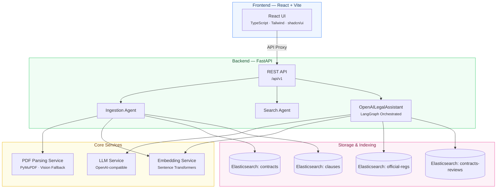
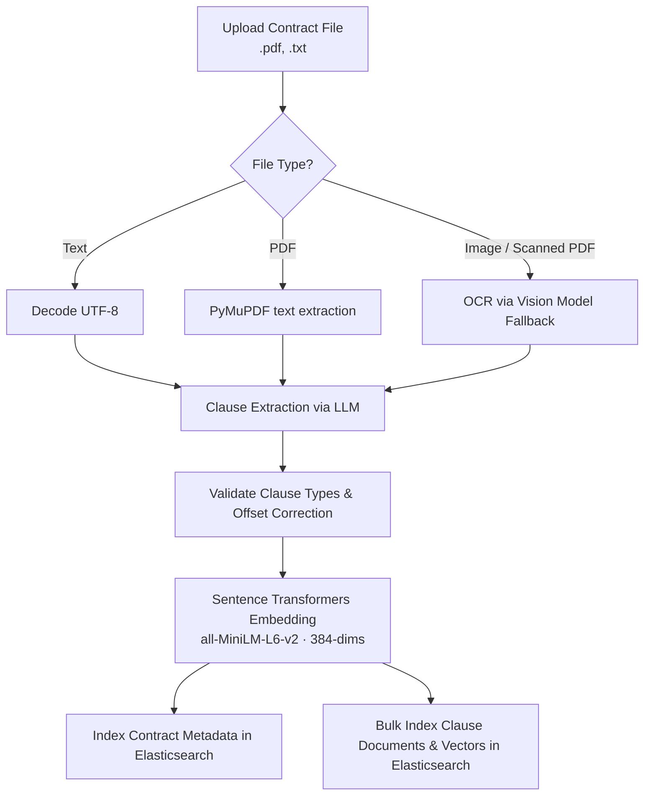
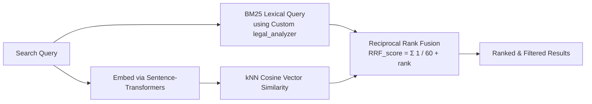
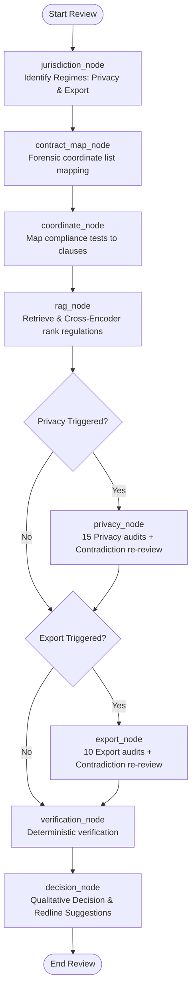

# ClauseGuard

**ClauseGuard** is an enterprise-grade, multi-agent legal contract review system. It ingests contracts (PDFs, text files, and images), extracts clauses via AI, supports hybrid lexical/semantic search, and performs compliance reviews using a sequential LangGraph-orchestrated agent workflow grounded by official regulations and expert legal precedents.

The application is structured with a FastAPI backend, an Elasticsearch storage layer, a Sentence-Transformers local embedding model, a Cross-Encoder reranker, and an interactive React web dashboard.

---

## Architecture


```mermaid
graph TB
    subgraph Frontend["Frontend — React + Vite"]
        UI[React UI<br/><small>TypeScript · Tailwind · shadcn/ui</small>]
    end

    subgraph Backend["Backend — FastAPI"]
        direction TB
        API[REST API<br/><small>/api/v1</small>]
        IA[Ingestion Agent]
        SA[Search Agent]
        OAI[OpenAILegalAssistant<br/><small>LangGraph Orchestrated</small>]
        
        API --> IA
        API --> SA
        API --> OAI
    end

    subgraph Services["Core Services"]
        direction TB
        LLM[LLM Service<br/><small>OpenAI-compatible</small>]
        EMB[Embedding Service<br/><small>Sentence Transformers</small>]
        PDF[PDF Parsing Service<br/><small>PyMuPDF · Vision Fallback</small>]
    end

    subgraph Storage["Storage & Indexing"]
        ES_Contracts[(Elasticsearch: contracts)]
        ES_Clauses[(Elasticsearch: clauses)]
        ES_Regs[(Elasticsearch: official-regs)]
        ES_Reviews[(Elasticsearch: contracts-reviews)]
    end

    UI -- "API Proxy" --> API
    IA --> PDF
    IA --> EMB
    IA --> ES_Contracts
    IA --> ES_Clauses
    
    OAI --> LLM
    OAI --> EMB
    OAI --> ES_Regs
    OAI --> ES_Reviews
    
    style Frontend fill:#eff6ff,stroke:#3b82f6,color:#1e3a5f
    style Backend fill:#f0fdf4,stroke:#22c55e,color:#14532d
    style Services fill:#fefce8,stroke:#eab308,color:#713f12
    style Storage fill:#fdf2f8,stroke:#ec4899,color:#831843
```

---

## Detailed Data Flow (Ingestion to Output)

### 1. Data Ingestion Pipeline

ClauseGuard provides two specialized ingestion pipelines: one for user contracts and one for official regulatory databases.

#### A. Contract Ingestion
When a contract is uploaded via the UI or seed scripts, the system processes it through a multi-stage ingestion pipeline coordinated by `IngestionAgent` ([ingestion.py](file:///c:/Users/rohan/Documents/ClauseGuard-copy/clauseguard/agents/ingestion.py)):


```mermaid
flowchart TD
    A[Upload Contract File<br/>.pdf, .txt] --> B{File Type?}
    B -- "Text" --> C[Decode UTF-8]
    B -- "PDF" --> D[PyMuPDF text extraction]
    B -- "Image / Scanned PDF" --> E[OCR via Vision Model Fallback]
    C --> F[Clause Extraction via LLM]
    D --> F
    E --> F
    F --> G[Validate Clause Types & Offset Correction]
    G --> H[Sentence Transformers Embedding<br/>all-MiniLM-L6-v2 · 384-dims]
    H --> I[Index Contract Metadata in Elasticsearch]
    H --> J[Bulk Index Clause Documents & Vectors in Elasticsearch]
```

* **Parsing**: Handles text and PDF uploads via PyMuPDF (`fitz`). If a PDF page is scanned and lacks text, it falls back to rendering page images as PNG/JPEG base64 payloads to process via the configured vision model (e.g. `gpt-4o`).
* **LLM Clause Extraction**: Sends parsed text to the configured LLM to identify distinct legal clauses verbatim and categorize them into a standard `ClauseType` (e.g., `indemnity`, `liability_cap`, `termination`, `confidentiality`, `governing_law`, `data_protection`, `ip_assignment`, `force_majeure`, or `other`).
* **Offset Correction**: Verifies the exact starting and ending characters of each clause in the source text using fuzzy substring matching against the LLM's approximate offset coordinates.
* **Vector Embeddings**: Encodes clause texts into 384-dimensional dense vectors using a local Sentence-Transformers model (`all-MiniLM-L6-v2`).
* **Elasticsearch Storage**: 
  * Indexes contract metadata in `clauseguard-contracts`.
  * Indexes individual clauses, parent references, offsets, and their dense vector embeddings in `clauseguard-clauses`.

#### B. Hierarchical Official Regulations Ingestion (RAG Index)
To ground evaluations in binding legal authority, official regulatory bodies are ingested using `ingest_official_regs.py` ([ingest_official_regs.py](file:///c:/Users/rohan/Documents/ClauseGuard-copy/scripts/ingest_official_regs.py)):
* **Files Processed**:
  * `GDPR.pdf` (Official GDPR Privacy Principles)
  * `Australian Privacy Act.pdf` (Australian Privacy Act)
  * `EU Export Control.pdf` (EU Export Control Principles)
  * `Australia Export Control.pdf` (Australian Export Control Act)
* **Hierarchical Scanning**: The parser scans for major divisions (Chapters, Parts, Sections, Divisions, Articles, Principles) to index hierarchy tags and summaries.
* **Child-Parent Chunking**: Splitting is executed using overlapping token windows (500–800 tokens). To preserve semantic context, each child chunk is prepended with the parent's title, summary, and location hierarchy.
* **Elasticsearch Index**: Document metadata and vectors are stored in `clauseguard-official-regs`.

---

### 2. Hybrid Lexical & Semantic Search

ClauseGuard uses a hybrid search agent ([search.py](file:///c:/Users/rohan/Documents/ClauseGuard-copy/clauseguard/agents/search.py)) to fetch clauses from indexed contracts:


```mermaid
flowchart LR
    Query[Search Query] --> Vec[Embed via Sentence-Transformers]
    Query --> BM25[BM25 Lexical Query<br/>using Custom legal_analyzer]
    Vec --> KNN[kNN Cosine Vector Similarity]
    BM25 --> RRF[Reciprocal Rank Fusion<br/>RRF_score = Σ 1 / 60 + rank]
    KNN --> RRF
    RRF --> Ranked[Ranked & Filtered Results]
```

* **Custom Analysis**: Uses `legal_analyzer` (standard tokenizer + lowercase + stopword + snowball stemming filters) for precise matches of legal terms.
* **Reciprocal Rank Fusion (RRF)**: Merges the scores of BM25 (exact keyword match) and kNN (semantic cosine similarity) queries. It calculates:
  $$\text{RRF\_score} = \sum_{m \in M} \frac{1}{60 + \text{rank}_m}$$

---

### 3. Compliance Review & LangGraph Sequential Agent Workflow

ClauseGuard reviews contracts through `OpenAILegalAssistant` ([openai_assistant.py](file:///c:/Users/rohan/Documents/ClauseGuard-copy/clauseguard/openai_assistant.py)), which builds and executes a sequential **LangGraph Agent Workflow** composed of 8 nodes:


```mermaid
flowchart TD
    Start([Start Review]) --> JNode[jurisdiction_node<br/>Identify Regimes: Privacy & Export]
    JNode --> CMapNode[contract_map_node<br/>Forensic coordinate list mapping]
    CMapNode --> CoordNode[coordinate_node<br/>Map compliance tests to clauses]
    CoordNode --> RAGNode[rag_node<br/>Retrieve & Cross-Encoder rank regulations]
    
    RAGNode --> Route1{Privacy Triggered?}
    Route1 -- Yes --> PNode[privacy_node<br/>15 Privacy audits + Contradiction re-review]
    Route1 -- No --> Route2{Export Triggered?}
    
    PNode --> Route2
    Route2 -- Yes --> ENode[export_node<br/>10 Export audits + Contradiction re-review]
    Route2 -- No --> VNode[verification_node<br/>Deterministic verification]
    
    ENode --> VNode
    VNode --> DNode[decision_node<br/>Qualitative Decision & Redline Suggestions]
    DNode --> End([End Review])
```

#### Node Execution Details:
1. **Jurisdiction Identification Node (`jurisdiction_node`)**: Evaluates the contract text to check if the primary privacy (EU GDPR or Australian Privacy Act) or export control regimes (EU or Australian Export Control) apply. Sets boolean triggers (`privacy_triggered` and `export_triggered`).
2. **Contract Coordinate Map Node (`contract_map_node`)**: Scans all contract elements to produce a structured map containing page numbers, section identifiers, headings, and starting text coordinates.
3. **Compliance Test Coordinate Mapping Node (`coordinate_node`)**: Maps the 15 privacy and/or 10 export compliance tests to candidate contract clauses.
4. **Regulatory RAG Node (`rag_node`)**: Searches `clauseguard-official-regs` in Elasticsearch. It ranks and selects matching official regulatory clauses using a **Cross-Encoder model** (`cross-encoder/ms-marco-MiniLM-L-6-v2`) to provide context for the audit.
5. **Privacy Compliance Audit Node (`privacy_node`)**: Audits the contract against 15 key privacy controls (e.g. TOMs, Retention, Breach Timeframes) incorporating:
   * **Applicability Gates**: Bypasses irrelevant controls (e.g. "Children's Data Protections" is marked `NOT_APPLICABLE` with `1.0` confidence if no matching child-data keywords exist).
   * **Legal Adequacy Evaluation**: Evaluates whether contract language satisfies obligations, allowing semantic equivalents.
   * **Contradiction Detection / Rereview**: If a control is initially marked `ABSENT` but keyword queries locate relevant contract text, it triggers a secondary re-review to correct the status to `PRESENT` or `PARTIALLY_PRESENT`, preventing false negatives.
   * **Confidence Calibration**: Limits confidence based on evidence presence (caps of 40% for ABSENT, 70% for PARTIALLY_PRESENT, and up to 95% for PRESENT).
   * **Relevance Filtering**: Ignores proximity false positives (e.g. ensuring data storage clauses do not satisfy deletion requirements).
6. **Export Control Compliance Audit Node (`export_node`)**: Audits the contract against 10 export control tests using RAG grounding, applicability gates, and confidence calibration.
7. **Authoritative Verification Node (`verification_node`)**: Validates findings deterministically against the retrieved regulations context.
8. **Qualitative Decision Node (`decision_node`)**: Generates an **Executive Summary**, compiles **Redline Suggestions** for failed/partial controls, assigns a **Final Decision Outcome** (`PASS`, `CONDITIONAL_PASS`, or `FAIL`), and saves the review in `contracts-reviews`.

#### Legal Knowledge Base Single Source of Truth
Operating parameters, triggers, and specific regulations for dozens of global jurisdictions (including EU/EEA, UK, USA, India DPDP Act, Singapore, South Korea, China, UAE/DIFC/ADGM, and Saudi Arabia) are managed by `clauseguard/legal_knowledge.py` ([legal_knowledge.py](file:///c:/Users/rohan/Documents/ClauseGuard-copy/clauseguard/legal_knowledge.py)). It serves as a dependency-free, memory-only rule library.

---

### 4. Output Generation & Exports

* **Interactive UI**: Displays the final safety gauge, executive summaries, risk categorization cards, missing protections, and suggested redline panels.
* **Excel Export (Web & API)**: Generates detailed sheets using `openpyxl` with color-coded severities, frozen panes, and columns for:
  `Issue ID` | `Domain` | `Clause / Section` | `Jurisdiction(s)` | `Finding` | `Risk Level` | `Applicable Laws` | `Recommended Redline` | `Fallback Position`

---

## Tech Stack

| Component | Technology | Description |
|:------|:-----------|:------------|
| **Frontend** | React 18, TypeScript, Vite, Tailwind CSS, shadcn/ui, Lucide Icons | Responsive legal dashboard, file uploader, and interactive visual audits. |
| **Backend** | Python 3.10+, FastAPI, Pydantic v2, Pydantic-Settings, Uvicorn, LangGraph, LangChain | Async web API, sequential agent graphs, and pipeline services. |
| **Search Engine**| Elasticsearch 8.16+ | Handles BM25 text indices, kNN cosine vector fields, and RRF rank fusion. |
| **Embeddings & Ranking**| Sentence Transformers (`all-MiniLM-L6-v2`), CrossEncoder (`ms-marco-MiniLM-L-6-v2`) | Embeds text and reranks retrieved regulations context. |
| **LLM Services** | OpenAI API (compatible endpoint) | Executes agent workflows, clause extraction, decisions, and summarization. |
| **Parsing & PDF** | PyMuPDF (`fitz`), PyPDF2 | Extracts layout text, counts pages, and renders page images for vision OCR. |
| **Reports** | openpyxl | Programmatically compiles styled Excel sheets. |

---

## Project Structure

```
ClauseGuard/
├── clauseguard/                    # Backend Source Code
│   ├── main.py                     # FastAPI application setup, lifespan events, and Uvicorn runner
│   ├── config.py                   # Pydantic BaseSettings loading configs from .env
│   ├── openai_assistant.py         # Sequential LangGraph compliance review agent workflow driver
│   ├── legal_knowledge.py          # Single source of truth for operating rules, triggers, and global jurisdictions
│   ├── agents/                     # Processing Agents
│   │   ├── ingestion.py            # Coordinate contract text extraction, clause parser, offsets, and embeddings
│   │   └── search.py               # Orchestrates BM25 + kNN hybrid searches
│   ├── services/                   # Utility Wrappers
│   │   ├── elasticsearch_service.py# Manages ES mappings, indexing, and Reciprocal Rank Fusion queries
│   │   ├── embedding_service.py    # Implements Sentence Transformers for local vector generation
│   │   └── pdf_service.py          # Extracts text from PDFs and TXT files using PyMuPDF
│   ├── models/                     # Pydantic Schemas
│   │   ├── clause.py               # ExtractedClause and ClauseType structures
│   │   ├── contract.py             # ContractMetadata and responses
│   │   ├── openai_legal.py         # Structured output schemas, final decisions, and redline suggestions
│   │   └── search.py               # Search parameters and hits
├── frontend/                       # React Frontend Application
│   ├── src/
│   │   ├── pages/                  # Dashboard, Upload, Detail, Search, Review views
│   │   ├── components/             # Reusable UI widgets (e.g. RiskGauge, FindingCard)
│   │   ├── lib/                    # HTTP client configuration and constants
│   │   └── types/                  # TypeScript API declarations
│   └── package.json
├── scripts/                        # Maintenance & CLI Utilities
│   ├── ingest_official_regs.py    # Ingests and chunk-indexes official regulatory PDFs (GDPR, Privacy Act) in ES
│   ├── run_regression_suite.py     # Runs automated assertions checking compliance audits on sample PDFs (e.g. Interflex)
│   ├── test_accuracy.py            # Tests mapping accuracy, proximity false-positives, and inapplicable gating
│   ├── test_evidence_grounding.py  # Tests mock contract evidence status evaluation
│   ├── test_review_export.py       # Test script generating sample Excel review sheets
│   └── run_openai_test.py          # Quick connection sanity check for the OpenAI API
├── sample_contracts/               # Standard legal files for seeding (NDAs, DPA, Services)
├── seed.sh                         # Bash script to parse and upload sample contracts
├── docker-compose.yml              # Configures local Elasticsearch Docker container
├── pyproject.toml                  # Python package metadata and requirements
└── README.md                       # Comprehensive documentation (this file)
```

---

## Getting Started

### Prerequisites
* Python 3.10 or higher
* Node.js 18 or higher
* Docker installed and running

### 1. Launch Elasticsearch
Start the local Elasticsearch instance using Docker Compose:
```bash
docker compose up -d
```
Verify ES is running by navigating to `http://localhost:9200`.

### 2. Configure Environment Variables
Copy the sample environment file and enter your API credentials:
```bash
cp .env.example .env
```
Ensure your `.env` contains valid OpenAI parameters:
```env
OPENAI_API_KEY=sk-your-openai-api-key
OPENAI_BASE_URL=https://api.openai.com/v1
OPENAI_MODEL=gpt-4o-mini
OPENAI_VISION_MODEL=gpt-4o
```

### 3. Install & Start Backend
Install the package in editable mode and run the development server:
```bash
pip install -e .
clauseguard
```
The FastAPI backend starts at `http://localhost:8000`. On first start, it will download local embedding and Cross-Encoder ranking models.

### 4. Index Official Regulations (Required for RAG)
Run the script to parse and vector-index GDPR and export control PDF documents:
```bash
python scripts/ingest_official_regs.py
```

### 5. CLI Auditing & Generation
Use the `legal.py` CLI tool to run reviews and generation from the command line:
```bash
# Run a full compliance audit and output a JSON report
python legal.py review sample_contracts/sample_nda.txt

# Run risk analysis only
python legal.py risks sample_contracts/sample_nda.txt
```

### 6. Install & Start Frontend
In a separate terminal, navigate to the frontend directory, install packages, and start the development server:
```bash
cd frontend
npm install
npm run dev
```
Open `http://localhost:5173` in your browser. The Vite dev server will proxy API requests to port `8000`.

### 7. Seeding Sample Contracts (Optional)
To quickly populate the dashboard with sample contracts:
```bash
bash seed.sh
```

### 8. Running Tests (Optional)
To run accuracy, grounding, and regression tests verifying the sequential LangGraph nodes:
```bash
# Run regression tests on sample documents
python scripts/run_regression_suite.py

# Run accuracy and evidence grounding checks
python scripts/test_accuracy.py
python scripts/test_evidence_grounding.py
```

---

## Configuration Reference

The following environment variables configure the backend (defined in `clauseguard/config.py`):

| Variable | Default Value | Description |
|:---------|:--------------|:------------|
| `OPENAI_API_KEY` | `""` | API key for OpenAI (or custom model provider) |
| `OPENAI_BASE_URL`| `https://api.openai.com/v1` | Base endpoint for the chat models |
| `OPENAI_MODEL`   | `gpt-4o-mini` | Model for clause extraction, risk, and compliance agents |
| `OPENAI_VISION_MODEL` | `gpt-4o` | Model for OCR processing of scanned documents/images |
| `ELASTICSEARCH_URL`| `http://localhost:9200` | Local or remote Elasticsearch instance |
| `EMBEDDING_MODEL`| `all-MiniLM-L6-v2` | Sentence-Transformer model loaded on startup |
| `ES_CONTRACTS_INDEX` | `clauseguard-contracts` | Name of the index storing contract metadatas |
| `ES_CLAUSES_INDEX` | `clauseguard-clauses` | Name of the index storing clause text and vector fields |
| `OPENAI_DUMP_DIR`| `openai_dumps` | Folder storing query audit logs |

---

## API Endpoints

All backend endpoints are prefixed with `/api/v1`.

### Core Endpoints

| Method | Endpoint | Description |
|:-------|:---------|:------------|
| `GET` | `/health` | Sanity check returning API health status |
| `POST` | `/contracts/upload` | Ingests contract files (multi-part form data) |
| `GET` | `/contracts/` | Returns list of all ingested contracts |
| `GET` | `/contracts/{id}` | Fetches metadata for a specific contract |
| `GET` | `/contracts/{id}/clauses` | Fetches extracted clauses of a contract |
| `POST` | `/search/` | Performs hybrid search across clauses |
| `POST` | `/review/{contract_id}` | Runs multi-agent compliance review on a contract |
| `GET` | `/review/{contract_id}/latest` | Fetches latest review for a contract |
| `GET` | `/review/{contract_id}/history` | Fetches all previous reviews for a contract |
| `GET` | `/review/{contract_id}/export.xlsx` | Exports Excel report for the latest review |

---

## License

MIT
